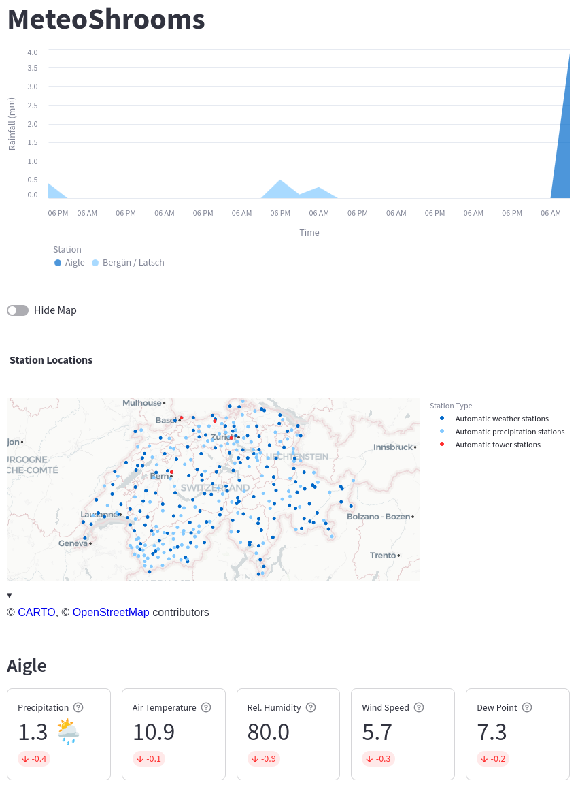

= MeteoShrooms

image:https://img.shields.io/github/v/tag/networkscientist/meteofungi[] image:https://github.com/networkscientist/meteofungi/actions/workflows/run_tests_ci.yml/badge.svg["Tests",link=https://github.com/networkscientist/meteofungi/actions/workflows/run_tests_ci.yml] image:https://img.shields.io/badge/License-CC%20BY--NC--SA%204.0-lightgrey.svg[https://github.com/networkscientist/meteofungi/blob/aea6b7708c70768c107d6a127da64378992a3aec/LICENSE.md]

image:https://img.shields.io/endpoint?url=https://raw.githubusercontent.com/astral-sh/ruff/main/assets/badge/v2.json[Ruff]

:toc: auto
:icons: font

ifdef::env-github[]
:tip-caption: :bulb:
:note-caption: :information_source:
:important-caption: :heavy_exclamation_mark:
:caution-caption: :fire:
:warning-caption: :warning:
endif::[]

With _MeteoShrooms_, you can keep track of the perfect conditions for mushroom hunting.
We take Open Government Data (OGD) from the official Swiss Meteorological Service MeteoSwiss to calculate key metrics.

[NOTE]
====
Contributors Welcome!
See https://github.com/networkscientist/meteofungi/blob/master/docs/CONTRIBUTING.adoc[Contributing Guidelines] for more info...
====

[NOTE]
====
Name change incoming: I discovered the project https://www.meteofunghi.it/[meteofunghi], an Italian web site that seems to predict mushrooms occurences with meteo data.
I had not previously known of the project; however, since its purpose is very similar to ours and their name is nearly identical, I decided to change the name of our project.
Their work deserves respect and they were the first ones to come up with the name meteofunghi, so it is only fair that we adapt.
Therefore, the MeteoFungi repository will change its name to MeteoShrooms.
Not immediately, though, because I currently lack insight what consequences a name change has.
I don't want to mess up the project, so you'll have to wait a bit for the new name...
This means that the dashboard is now available at https://meteoshrooms.streamlit.app[https://meteoshrooms.streamlit.app]
====

== Motivation

While hunting mushrooms happens in nature, a lot of the planning can be carried out beforehand.

Where are possible areas to find boletes?

Should you leave the house right now or are you already too late?

And will your current small basket be large enough or is it time to invest in something bigger?

Meteorological data, time series of past findings as well as other datasets can give us valuable insights.

== Concept

=== Overarching Vision

The main goal is to develop a model to predict mushrooms occurences using OGD data.
I suggest starting with _meteo_ data by https://www.meteoswiss.admin.ch/services-and-publications/service/open-data.html[MeteoSwiss], _soil_ properties (see for example https://data.geo.admin.ch/browser/index.html[data.geo.admin.ch] or https://opendata.swiss/de[opendata.swiss]) and using open _mushroom observation data_ from https://www.gbif.org/[GBIF].

=== Spatial

Currently, the _MeteoShrooms_ project is focussed on Switzerland, as the Swiss meteorological agency https://www.meteoswiss.admin.ch[MeteoSwiss] has started to provide access to their data as https://www.meteoswiss.admin.ch/services-and-publications/service/open-data.html[Open Government Data (OGD)].

=== Technical

A main aim is to have sound results calculated efficiently.
Therefore, Python _Polars_ is used for calculations, wherever possible.
Its _LazyFrames_ optimize the workflow.
Data quality is validated through _Pandera_.
Compressed _Parquet_-Files save storage space and up-/download bandwith.

Currently, the repository hosts all parts of the modelling process: 1. Data Preparation, 2. Model Calculations and 3. Data Presentation:

. Data Preparation: Download data from OGD sources and bring them into form needed for next step.
Ensure data quality,
. Model Calculations: Perform the calculations to generate predictions from observed data,
. Data Presentation: Show results on map and/or dashboard.
Include documentation of sources and methodology.

[source,mermaid]
....
flowchart TD
    ground[(Ground Properties)] --> prep
    meteo[(Meteo Data)] --> prep
    mush[(Mushroom Observations)] --> prep
    prep[Prepare Data] --> train
    train[Train AI Model] --> calc
    train --> model@{ shape: lean-l , label: AI Model}
    calc[Calculate Model Predictions] --> present
    present[Present Results]
....

=== Visualization

Metrics and time series visulizations are currently hosted as a Streamlit dashboard, so https://meteoshrooms.streamlit.app[check it out].

== Roadmap

A high-level roadmap structured along the planned release milestones.
For a more detailed overview, see either https://github.com/networkscientist/meteofungi/issues[Issues] or the detailed https://github.com/users/networkscientist/projects/7[Project Planner], where the project is managed.

=== Release v0.3 image:https://img.shields.io/github/milestones/progress/networkscientist/meteofungi/1[GitHub milestone details]

* [x] Define set of issue tags https://github.com/networkscientist/meteofungi/issues/40[#40]
* [x] Develop linting concept https://github.com/networkscientist/meteofungi/issues/57[#57]
* [x] Write CI test action https://github.com/networkscientist/meteofungi/issues/56[#56]
* [ ] Define clear goals for project https://github.com/networkscientist/meteofungi/issues/54[#54]
* [ ] Change project name to MeteoShrooms https://github.com/networkscientist/meteofungi/issues/55[#55]
* [ ] Add example projects and usage walkthroughs https://github.com/networkscientist/meteofungi/issues/59[#59]
* [ ] _Release v0.3_

=== Release v0.4 image:https://img.shields.io/github/milestones/progress/networkscientist/meteofungi/2[GitHub milestone details]

* [ ] Increase test coverage to 25% https://github.com/networkscientist/meteofungi/issues/53[#53]
* [ ] Define consistent mypy concept https://github.com/networkscientist/meteofungi/issues/58[#58]
* [ ] Extend package metadata in pyproject.toml https://github.com/networkscientist/meteofungi/issues/61[#61]
* [ ] Develop issue templates https://github.com/networkscientist/meteofungi/issues/64[#64]
* [ ] Make passing of CI test action mandatory https://github.com/networkscientist/meteofungi/issues/67[#67]
* [ ] Write Concept on the AI Part https://github.com/networkscientist/meteofungi/issues/68[#68]
* [ ] _Release v0.4_

=== Release v0.5 image:https://img.shields.io/github/milestones/progress/networkscientist/meteofungi/3[GitHub milestone details]

* [x] Add badges to Readme https://github.com/networkscientist/meteofungi/issues/60[#60]
* [ ] Add st.pills element to select type of station to display in st.multiselect https://github.com/networkscientist/meteofungi/issues/22[#22]
* [ ] Create a build and test it locally https://github.com/networkscientist/meteofungi/issues/62[#62]
* [ ] Integrate profiling/performance benchmarks/tests https://github.com/networkscientist/meteofungi/issues/65[#65]
* [ ] Define Geodata Model Basics https://github.com/networkscientist/meteofungi/issues/69[#69]
* [ ] Move Dashboard Calculations to dashboard.calculations https://github.com/networkscientist/meteofungi/issues/73[#73]
* [ ] _Release v0.5_

=== Release v0.6 image:https://img.shields.io/github/milestones/progress/networkscientist/meteofungi/4[GitHub milestone details]

* [ ] Set up PyPI publishing workflow https://github.com/networkscientist/meteofungi/issues/63[#63]
* [ ] Update Meteo Data with Recent Values Instead of Downloading Entire Dataset https://github.com/networkscientist/meteofungi/issues/74[#74]
* [ ] Can We Have the Prepared Data as an Asset with Consistent URL? https://github.com/networkscientist/meteofungi/issues/75[#75]
* [ ] _Release v0.6_

=== Release v0.7 image:https://img.shields.io/github/milestones/progress/networkscientist/meteofungi/7[GitHub milestone details]

* [ ] Move from Streamlit Cloud to stlite for WASM https://github.com/networkscientist/meteofungi/issues/52[#52]

=== Release v0.8 image:https://img.shields.io/github/milestones/progress/networkscientist/meteofungi/8[GitHub milestone details]

* [ ] Develop First Version of AI Model https://github.com/networkscientist/meteofungi/issues/71[#71]

=== Release v0.9 image:https://img.shields.io/github/milestones/progress/networkscientist/meteofungi/9[GitHub milestone details]

=== Release v1.0 image:https://img.shields.io/github/milestones/progress/networkscientist/meteofungi/10[GitHub milestone details]

* [ ] Develop AI Model for Mushroom Occurence Prediction https://github.com/networkscientist/meteofungi/issues/70[#70]